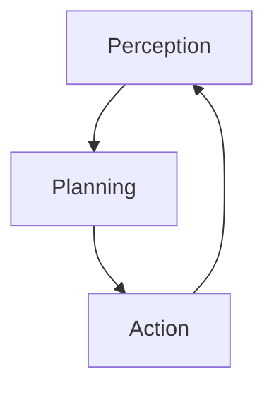

# RFC 0001: Voice-First AI Agent Architecture for Solana Earphone

## Abstract

This RFC proposes a voice-first AI agent architecture for the Solana Earphone platform, focusing on high-quality voice interaction and modular agent design. The architecture enables developers to build voice-interactive AI agents with a clear perception-planning-action loop.

## Motivation

As wearable devices become increasingly prevalent, particularly smart earphones, there is a growing need for an AI agent architecture optimized for voice interaction scenarios. This architecture should leverage Solana Earphone's hardware capabilities while maintaining flexibility for diverse applications.

## Technical Design

### 1. Voice-First Interaction Pipeline

#### 1.1 Audio Processing Chain


#### 1.2 Core Components

1. **Audio Capture**
   - Sampling Rate: 48kHz
   - Bit Depth: 24-bit
   - Channels: Stereo
   - Buffer Size: 20ms

2. **Noise Reduction**
   - Active Noise Cancellation (ANC)
   - Environmental Sound Classification
   - Signal-to-Noise Ratio (SNR) Enhancement

3. **Voice Enhancement**
   - Acoustic Echo Cancellation
   - Automatic Gain Control
   - Dynamic Range Compression

4. **Voice Activity Detection (VAD)**
   - Low-latency detection (<10ms)
   - Energy-based and ML-based hybrid approach
   - Configurable sensitivity levels

5. **Automatic Speech Recognition (ASR)**
   - Streaming recognition support
   - Multi-language capability
   - Context-aware processing

6. **Natural Language Understanding (NLU)**
   - Intent classification
   - Entity extraction
   - Context management

#### 1.3 Voice Interaction Protocol

```typescript
interface VoiceStream {
  sessionId: string;
  timestamp: number;
  audioData: ArrayBuffer;
  metadata: {
    sampleRate: number;
    channels: number;
    encoding: string;
    deviceInfo: DeviceMetadata;
  };
}

interface DeviceMetadata {
  deviceId: string;
  firmwareVersion: string;
  batteryLevel: number;
  connectionStatus: ConnectionState;
}

interface ProcessedVoiceData {
  text: string;
  confidence: number;
  intents: Intent[];
  entities: Entity[];
  context: Context;
}
```

### 2. Modular Agent Architecture

#### 2.1 Core Agent Loop



#### 2.2 Component Specifications

```typescript
interface Agent {
  // Perception Module
  perception: {
    inputProcessors: InputProcessor[];
    contextManager: ContextManager;
    stateTracker: StateTracker;
  };
  
  // Planning Module
  planning: {
    intentResolver: IntentResolver;
    taskPlanner: TaskPlanner;
    strategySelector: StrategySelector;
    goalManager: GoalManager;
  };
  
  // Action Module
  action: {
    executors: ActionExecutor[];
    feedbackCollector: FeedbackCollector;
    resultValidator: ResultValidator;
  };
}

interface AgentState {
  currentContext: Context;
  activeGoals: Goal[];
  executionStatus: ExecutionStatus;
  shortTermMemory: MemoryBuffer;
  longTermMemory: MemoryStore;
}
```

#### 2.3 Agent Lifecycle Management

1. **Initialization**
```typescript
class AgentLifecycle {
  async initialize(config: AgentConfig): Promise<void> {
    await this.loadModules();
    await this.setupPipeline();
    await this.connectToServices();
  }
  
  async loadModules(): Promise<void> {
    // Load required modules
  }
  
  async setupPipeline(): Promise<void> {
    // Setup processing pipeline
  }
}
```

2. **Execution Loop**
```typescript
class AgentExecutionLoop {
  async run(): Promise<void> {
    while (this.isActive) {
      const input = await this.perception.collect();
      const plan = await this.planning.process(input);
      const result = await this.action.execute(plan);
      await this.feedback.process(result);
    }
  }
}
```

## Performance Requirements

1. **Latency**
   - End-to-end processing: < 500ms
   - Voice detection: < 10ms
   - ASR processing: < 200ms
   - Agent response: < 300ms

2. **Resource Usage**
   - Memory: < 200MB per agent instance
   - CPU: < 30% on single core
   - Network: < 50KB/s average bandwidth

3. **Scalability**
   - Support for 1000+ concurrent users per cluster
   - Horizontal scaling capability
   - Load balancing across instances

## Security Considerations

1. **Voice Data Protection**
   - End-to-end encryption for voice streams
   - Secure storage for voice data
   - Privacy-preserving processing

2. **Agent Security**
   - Authentication and authorization
   - Rate limiting and abuse prevention
   - Secure plugin execution

## Implementation Guidelines

1. **Development Stack**
   - Core: Python 3.9+
   - API Layer: FastAPI
   - Real-time Processing: Rust
   - Plugin System: Python + Node.js

2. **Deployment**
   - Container: Docker
   - Orchestration: Kubernetes
   - Service Mesh: Istio

## Future Work

1. **Short Term**
   - Implement basic voice processing pipeline
   - Develop core agent framework
   - Create developer SDK

2. **Medium Term**
   - Add advanced context management
   - Improve multi-agent coordination
   - Enhance feedback loop mechanism

## References

1. Solana Earphone Hardware Specifications
2. Voice Processing Standards (ITU-T P.800)
3. Agent Architecture Best Practices

## Authors

[Your Name]

## Changelog

- 2024-03-xx: Initial draft
