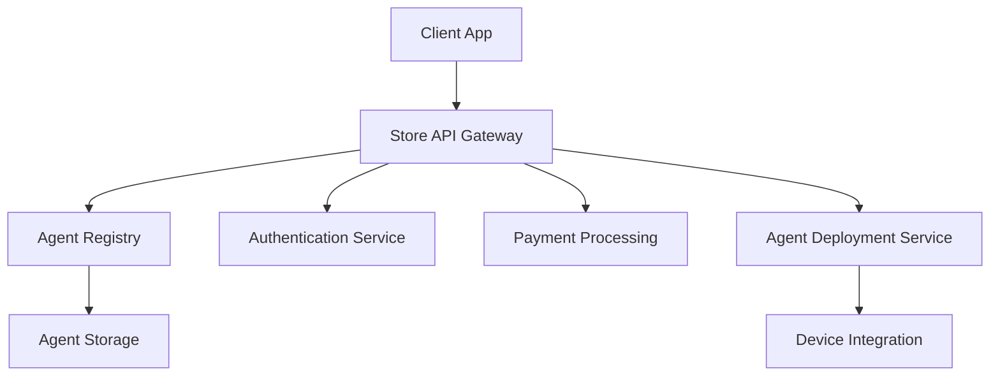

# RFC 0003: Agent Store Architecture for Solana Earphone

## Abstract

This RFC proposes the architecture and implementation details for the Solana Earphone Agent Store, a marketplace platform that enables users to discover, purchase, and manage AI voice agents for their earphones.

## Motivation

As voice interaction becomes increasingly important for Solana Earphone users, there is a need for a centralized marketplace where users can access various AI agents with different capabilities. The Agent Store will facilitate the distribution of voice agents while ensuring security, quality, and seamless integration.

## Technical Design

### 1. Store Architecture

#### 1.1 System Components



#### 1.2 Core Components

1. **Store API Gateway**
   - RESTful API endpoints
   - GraphQL support
   - Rate limiting
   - Request validation

2. **Agent Registry**
   - Agent metadata storage
   - Version control
   - Compatibility tracking
   - Performance metrics

3. **Authentication Service**
   - User authentication
   - Developer authentication
   - License management
   - Access control

4. **Payment Processing**
   - Multiple payment methods
   - Subscription management
   - Revenue sharing
   - Refund handling

5. **Agent Deployment Service**
   - Over-the-air updates
   - Rollback support
   - Progressive deployment
   - Health monitoring

#### 1.3 Data Models

```typescript
interface Agent {
  id: string;
  name: string;
  version: string;
  description: string;
  developer: Developer;
  pricing: PricingModel;
  requirements: SystemRequirements;
  capabilities: AgentCapability[];
  ratings: Rating[];
  statistics: AgentStatistics;
}

interface Developer {
  id: string;
  name: string;
  verificationStatus: VerificationStatus;
  revenueShare: number;
  publishedAgents: string[];
}

interface PricingModel {
  type: 'one-time' | 'subscription';
  price: number;
  currency: string;
  trialPeriod?: number;
  subscriptionPlans?: SubscriptionPlan[];
}

interface AgentStatistics {
  downloads: number;
  activeUsers: number;
  averageRating: number;
  performanceMetrics: PerformanceMetrics;
}
```

### 2. Store Features

#### 2.1 Discovery and Search

```typescript
interface SearchService {
  // Search functionality
  async search(query: SearchQuery): Promise<SearchResult>;
  
  // Category browsing
  async getCategories(): Promise<Category[]>;
  
  // Recommendations
  async getRecommendations(userId: string): Promise<Agent[]>;
  
  // Featured content
  async getFeaturedAgents(): Promise<Agent[]>;
}

interface SearchQuery {
  keyword?: string;
  category?: string;
  priceRange?: PriceRange;
  ratings?: number;
  capabilities?: string[];
  sortBy?: SortOption;
}
```

#### 2.2 Purchase and Deployment Flow

```typescript
class AgentDeployment {
  async purchaseAgent(agentId: string, userId: string): Promise<Purchase> {
    // Validate purchase
    await this.validatePurchase(agentId, userId);
    
    // Process payment
    const payment = await this.processPayment();
    
    // Deploy agent
    await this.deployToDevice(agentId, userId);
    
    // Return purchase details
    return this.createPurchaseRecord();
  }
  
  private async deployToDevice(agentId: string, userId: string): Promise<void> {
    // Deployment implementation
  }
}
```

## Performance Requirements

1. **Response Times**
   - Store browsing: < 200ms
   - Search results: < 500ms
   - Purchase flow: < 2s
   - Agent deployment: < 5s

2. **Scalability**
   - Support 100,000+ concurrent users
   - Handle 1000+ agent listings
   - Process 100+ transactions per second

3. **Availability**
   - 99.9% uptime
   - Global CDN distribution
   - Automatic failover

## Security Considerations

1. **Agent Verification**
   - Code signing
   - Security scanning
   - Performance testing
   - Privacy compliance check

2. **Platform Security**
   - End-to-end encryption
   - Secure payment processing
   - DDoS protection
   - Rate limiting

3. **User Data Protection**
   - Data encryption
   - Privacy controls
   - GDPR compliance
   - Data retention policies

## Implementation Plan

### Phase 1: Core Infrastructure
- Basic store interface
- Agent listing and discovery
- Payment integration
- Basic deployment system

### Phase 2: Enhanced Features
- Advanced search
- Recommendations
- Reviews and ratings
- Developer portal

### Phase 3: Ecosystem Growth
- Analytics dashboard
- A/B testing
- Community features
- API marketplace

## Future Work

1. **Short Term**
   - Implement basic store functionality
   - Set up agent verification process
   - Create developer documentation

2. **Long Term**
   - AI-powered recommendations
   - Cross-device sync
   - Agent collaboration features
   - Marketplace analytics

## References

1. App Store Best Practices
2. Voice Agent Distribution Standards
3. Secure Marketplace Implementation Guidelines