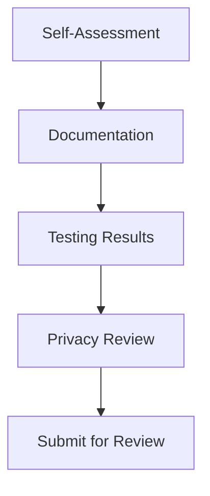
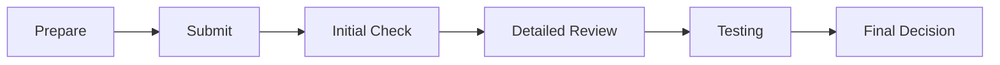

# RFC 0004: Agent Submission and Review Process for Solana Earphone

## Abstract

This RFC defines the comprehensive process for AI agent submission, review, and publication in the Solana Earphone ecosystem. It establishes clear guidelines, quality standards, and workflows to ensure the marketplace maintains high-quality agents while providing a transparent process for developers.

## Motivation

To build a thriving AI agent ecosystem, we need a well-defined process that:
- Ensures quality and safety of published agents
- Provides clear guidelines for developers
- Maintains user trust through consistent standards
- Protects platform integrity and user privacy
- Streamlines the review process for efficient operations

## Process Design

### 1. Developer Onboarding

#### 1.1 Developer Verification Levels

1. **Basic Level**
   - Email verification
   - Basic identity check
   - Limited to free agents
   - Maximum 2 submissions per month

2. **Verified Level**
   - Government ID verification
   - Company registration (if applicable)
   - Ability to publish paid agents
   - Up to 10 submissions per month

3. **Premium Level**
   - Full background check
   - Proven track record
   - Priority review process
   - Unlimited submissions
   - Advanced analytics access

#### 1.2 Required Documentation

- Developer agreement
- Privacy policy
- Terms of service
- Support policy
- Revenue sharing agreement

### 2. Agent Submission Process

#### 2.1 Pre-submission Checklist



1. **Required Materials**
   - Agent binary/package
   - Source code access (if required)
   - Documentation
   - Test reports
   - Privacy declaration
   - Marketing materials

2. **Technical Requirements**
   - Performance benchmarks
   - Memory usage limits
   - Battery impact assessment
   - Network usage patterns
   - Error handling protocols

3. **Documentation Requirements**
   - User guide
   - API documentation
   - Sample interactions
   - Limitation disclosure
   - Support information

#### 2.2 Submission Workflow



### 3. Review Process

#### 3.1 Review Stages

1. **Initial Screening (24-48 hours)**
   - Completeness check
   - Basic security scan
   - Documentation review
   - Policy compliance check

2. **Technical Review (3-5 days)**
   - Code review (if applicable)
   - Performance testing
   - Security assessment
   - Integration testing
   - Battery impact analysis

3. **User Experience Review (2-3 days)**
   - Interface evaluation
   - Voice interaction testing
   - Error handling verification
   - Help system assessment

4. **Privacy and Security Review (2-4 days)**
   - Data handling audit
   - Privacy compliance check
   - Security vulnerability assessment
   - Permission verification

#### 3.2 Review Criteria

1. **Performance Metrics**
   - Response time < 200ms
   - Memory usage < 50MB
   - Battery impact < 5%
   - Crash rate < 0.1%

2. **Quality Standards**
   - Voice recognition accuracy > 95%
   - Natural language understanding > 90%
   - User satisfaction score > 4.0/5.0
   - Error handling coverage > 95%

3. **Security Requirements**
   - Secure data transmission
   - Proper data encryption
   - Limited data collection
   - Clear user consent

### 4. Publication Process

#### 4.1 Approval States

```typescript
enum ApprovalState {
  SUBMITTED = 'submitted',
  IN_REVIEW = 'in_review',
  NEEDS_CHANGES = 'needs_changes',
  APPROVED = 'approved',
  REJECTED = 'rejected',
  PUBLISHED = 'published'
}
```

#### 4.2 Publication Workflow

1. **Pre-publication**
   - Final verification
   - Store listing review
   - Pricing confirmation
   - Marketing material approval

2. **Publication**
   - Staged rollout
   - Performance monitoring
   - User feedback collection
   - Analytics setup

3. **Post-publication**
   - 7-day monitoring period
   - User feedback analysis
   - Performance metrics review
   - Support system verification

### 5. Maintenance and Updates

#### 5.1 Update Categories

1. **Critical Updates**
   - Security fixes
   - Critical bug fixes
   - Expedited review (24 hours)

2. **Major Updates**
   - New features
   - Significant changes
   - Full review required

3. **Minor Updates**
   - Bug fixes
   - Performance improvements
   - Simplified review

#### 5.2 Version Management

```typescript
interface VersionControl {
  version: string;
  changes: ChangeLog[];
  compatibilityRange: string;
  rollbackPlan: RollbackStrategy;
  gradualRollout: RolloutPlan;
}
```

## Communication Channels

### 1. Developer Support

- Developer portal
- Support ticket system
- Developer forum
- Documentation wiki
- Office hours

### 2. Review Communication

- Review dashboard
- Automated notifications
- Direct messaging system
- Status updates
- Appeal process

## Timeline Guidelines

1. **Standard Review Process**
   - Total time: 7-14 days
   - Initial screening: 1-2 days
   - Technical review: 3-5 days
   - Final review: 2-3 days
   - Publication: 1-2 days

2. **Expedited Review**
   - Available for Premium developers
   - Total time: 3-5 days
   - Additional fee may apply

## Quality Assurance

### 1. Testing Requirements

- Unit tests
- Integration tests
- Performance tests
- Security tests
- User acceptance tests

### 2. Monitoring

- Performance metrics
- User feedback
- Error rates
- Usage patterns
- Support tickets

## Future Improvements

1. **Short Term**
   - Automated testing pipeline
   - Self-service tools
   - Review process dashboard

2. **Long Term**
   - AI-assisted review process
   - Automated security scanning
   - Real-time performance monitoring
   - Community review system

## References

1. App Store Review Guidelines
2. Voice AI Quality Standards
3. Privacy and Security Best Practices
4. Developer Experience Guidelines

## Authors

[Your Name]

## Changelog

- 2024-03-xx: Initial draft 