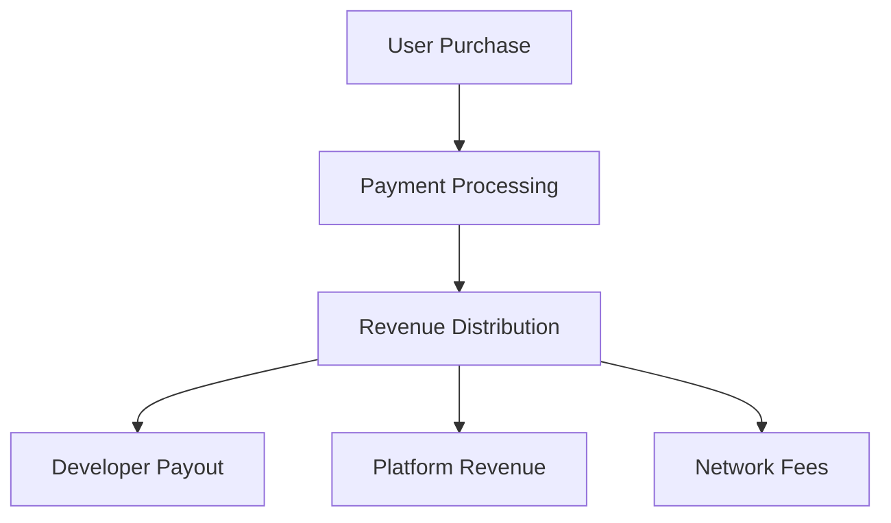

# RFC 0005: Agent Monetization and Revenue Sharing Model for Solana Earphone

## Abstract

This RFC defines the monetization strategies and revenue sharing model for the Solana Earphone agent ecosystem. It establishes a fair and sustainable economic framework that benefits developers, platform operators, and users while ensuring long-term ecosystem growth.

## Motivation

To build a thriving agent marketplace, we need a well-defined monetization strategy that:
- Incentivizes high-quality agent development
- Ensures fair compensation for developers
- Maintains platform sustainability
- Provides flexible pricing options for users
- Supports various business models

## Technical Design

### 1. Revenue Models

#### 1.1 Pricing Strategies

```typescript
interface PricingStrategy {
  type: PricingType;
  parameters: PricingParameters;
  restrictions?: PricingRestrictions;
  trialOptions?: TrialConfig;
}

enum PricingType {
  ONE_TIME = "one_time",
  SUBSCRIPTION = "subscription",
  USAGE_BASED = "usage_based",
  FREEMIUM = "freemium",
  HYBRID = "hybrid"
}

interface PricingParameters {
  basePrice: number;
  currency: string;
  billingCycle?: BillingCycle;
  usageTiers?: UsageTier[];
  featureTiers?: FeatureTier[];
}

interface UsageTier {
  threshold: number;
  price: number;
  unit: UsageUnit;
}

interface FeatureTier {
  name: string;
  features: string[];
  price: number;
}
```

#### 1.2 Revenue Distribution

```typescript
interface RevenueShare {
  developerShare: number;
  platformShare: number;
  networkFee: number;
  taxRate: number;
}

interface PayoutSchedule {
  frequency: PayoutFrequency;
  minimumAmount: number;
  currency: string;
  processingTime: number;
}

interface RevenueMetrics {
  totalRevenue: number;
  activeSubscriptions: number;
  averageRevenuePerUser: number;
  churnRate: number;
}
```

### 2. Payment Processing

#### 2.1 Payment Flow



#### 2.2 Payment Methods

1. **Cryptocurrency**
   - SOL (Primary)
   - USDC (Stable)
   - Other supported tokens

2. **Traditional Payment**
   - Credit/Debit cards
   - Bank transfers
   - Digital wallets

3. **Platform Credits**
   - Prepaid credits
   - Reward points
   - Promotional credits

### 3. Developer Compensation

#### 3.1 Revenue Share Tiers

1. **Standard Tier**
   - Developer: 70%
   - Platform: 25%
   - Network: 5%

2. **Premium Tier**
   - Developer: 80%
   - Platform: 15%
   - Network: 5%

3. **Enterprise Tier**
   - Developer: 85%
   - Platform: 10%
   - Network: 5%

#### 3.2 Performance Bonuses

```typescript
interface PerformanceBonus {
  criteria: BonusCriteria;
  threshold: number;
  reward: number;
  period: BonusPeriod;
}

interface BonusCriteria {
  type: "downloads" | "revenue" | "rating" | "retention";
  target: number;
  timeframe: number;
}
```

### 4. Subscription Management

#### 4.1 Subscription Types

1. **Individual Plans**
   - Monthly
   - Annual
   - Lifetime

2. **Family Plans**
   - Multi-user
   - Device sharing
   - Cross-platform

3. **Enterprise Plans**
   - Custom pricing
   - Volume discounts
   - Dedicated support

#### 4.2 Subscription Features

```typescript
interface SubscriptionPlan {
  id: string;
  name: string;
  price: number;
  billingCycle: BillingCycle;
  features: Feature[];
  limitations: Limitation[];
  upgradePath?: string[];
  downgradePath?: string[];
}

interface Feature {
  name: string;
  description: string;
  usageLimit?: number;
  restrictions?: string[];
}
```

### 5. Analytics and Reporting

#### 5.1 Developer Dashboard

```typescript
interface DeveloperAnalytics {
  revenue: RevenueMetrics;
  users: UserMetrics;
  performance: PerformanceMetrics;
  trends: TrendAnalysis;
}

interface RevenueMetrics {
  totalRevenue: number;
  subscriptionRevenue: number;
  oneTimeRevenue: number;
  refunds: number;
  netRevenue: number;
}

interface UserMetrics {
  totalUsers: number;
  activeUsers: number;
  newUsers: number;
  churnedUsers: number;
  userRetention: number;
}
```

#### 5.2 Reporting System

1. **Real-time Metrics**
   - Revenue tracking
   - User activity
   - Performance data
   - Conversion rates

2. **Periodic Reports**
   - Daily summaries
   - Weekly analytics
   - Monthly statements
   - Quarterly reviews

## Implementation Guidelines

### 1. Payment Integration

1. **Cryptocurrency Processing**
   - Solana Pay integration
   - Multi-token support
   - Transaction monitoring
   - Security measures

2. **Traditional Payment**
   - PCI compliance
   - Fraud prevention
   - Chargeback handling
   - Refund processing

### 2. Revenue Distribution

1. **Automated Payouts**
   - Scheduled transfers
   - Minimum thresholds
   - Currency conversion
   - Tax handling

2. **Manual Processing**
   - Large transactions
   - Special cases
   - Dispute resolution
   - Custom arrangements

## Security and Compliance

### 1. Financial Security

1. **Transaction Security**
   - End-to-end encryption
   - Secure key management
   - Fraud detection
   - Transaction monitoring

2. **Data Protection**
   - Financial data encryption
   - Privacy compliance
   - Data retention
   - Access control

### 2. Regulatory Compliance

1. **Tax Compliance**
   - Automated tax calculation
   - Tax reporting
   - Regional compliance
   - Documentation

2. **Financial Regulations**
   - KYC/AML compliance
   - Payment regulations
   - Reporting requirements
   - Audit trails

## Future Work

### 1. Short Term
- Implement basic payment processing
- Set up revenue sharing system
- Create developer dashboard
- Establish reporting system

### 2. Long Term
- Advanced analytics
- AI-powered pricing
- Dynamic revenue sharing
- Cross-platform monetization

## References

1. Solana Pay Documentation
2. Payment Processing Standards
3. Revenue Sharing Best Practices
4. Subscription Management Guidelines 