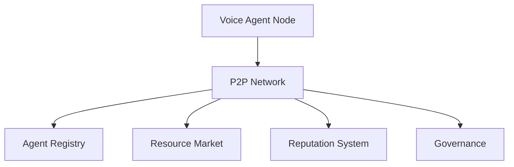

# RFC 0006: Decentralized Voice Agent Network for Solana Earphone

## Abstract

This RFC proposes a decentralized voice agent network architecture for Solana Earphone, enabling peer-to-peer voice agent interactions, distributed computing, and community-driven agent development. The network leverages blockchain technology to create a trustless, secure, and scalable ecosystem for voice agents.

## Motivation

Current voice agent systems are typically centralized, which can lead to:
- Single points of failure
- Limited scalability
- Privacy concerns
- High operational costs
- Restricted innovation

By implementing a decentralized voice agent network, we can:
- Enable peer-to-peer agent interactions
- Distribute computing resources
- Enhance privacy and security
- Reduce operational costs
- Foster community-driven innovation

## Technical Design

### 1. Network Architecture

#### 1.1 System Components



#### 1.2 Core Components

1. **Voice Agent Node**
   - Local agent execution
   - Resource contribution
   - Network participation
   - State synchronization

2. **P2P Network**
   - Agent discovery
   - Message routing
   - State propagation
   - Resource coordination

3. **Agent Registry**
   - Agent metadata
   - Version control
   - Access control
   - Distribution tracking

4. **Resource Market**
   - Computing resources
   - Storage allocation
   - Bandwidth trading
   - Service exchange

5. **Reputation System**
   - Agent performance
   - Node reliability
   - User feedback
   - Quality metrics

6. **Governance**
   - Protocol updates
   - Parameter adjustment
   - Dispute resolution
   - Community voting

### 2. Protocol Design

#### 2.1 Agent Protocol

```typescript
interface AgentNode {
  // Node identity
  nodeId: string;
  publicKey: string;
  capabilities: NodeCapability[];
  
  // Resource management
  resources: ResourcePool;
  allocation: ResourceAllocation;
  
  // Network state
  peers: PeerConnection[];
  agentRegistry: AgentRegistry;
  reputation: ReputationScore;
}

interface AgentRegistry {
  agents: Map<string, AgentMetadata>;
  versions: Map<string, VersionInfo>;
  permissions: Map<string, AccessControl>;
}

interface ResourceMarket {
  // Resource trading
  orders: MarketOrder[];
  transactions: Transaction[];
  settlements: Settlement[];
  
  // Resource pricing
  priceOracle: PriceFeed;
  marketMaker: MarketMaker;
}
```

#### 2.2 Communication Protocol

```typescript
interface AgentMessage {
  type: MessageType;
  sender: string;
  recipient: string;
  payload: MessagePayload;
  signature: string;
  timestamp: number;
}

interface AgentInteraction {
  // Voice interaction
  audioStream: AudioStream;
  processing: ProcessingRequest;
  response: AgentResponse;
  
  // State management
  context: InteractionContext;
  session: SessionState;
}
```

### 3. Resource Management

#### 3.1 Resource Types

1. **Computing Resources**
   - CPU cycles
   - GPU acceleration
   - Memory allocation
   - Processing power

2. **Storage Resources**
   - Agent data
   - User preferences
   - Interaction history
   - Model storage

3. **Network Resources**
   - Bandwidth
   - Latency
   - Connection quality
   - Routing capacity

#### 3.2 Resource Allocation

```typescript
interface ResourceAllocation {
  // Resource limits
  maxCpu: number;
  maxMemory: number;
  maxStorage: number;
  maxBandwidth: number;
  
  // Usage tracking
  currentUsage: ResourceUsage;
  allocationHistory: AllocationRecord[];
  
  // Optimization
  priority: PriorityLevel;
  scheduling: SchedulingPolicy;
}
```

### 4. Security and Privacy

#### 4.1 Security Measures

1. **Authentication**
   - Node identity verification
   - Agent signature validation
   - Permission management
   - Access control

2. **Encryption**
   - End-to-end encryption
   - Secure key exchange
   - Data encryption
   - Secure storage

3. **Privacy Protection**
   - Zero-knowledge proofs
   - Private computation
   - Data anonymization
   - Privacy-preserving analytics

#### 4.2 Trust Model

```typescript
interface TrustSystem {
  // Reputation tracking
  reputation: ReputationScore;
  history: TrustHistory;
  
  // Verification
  proofs: VerificationProof[];
  attestations: Attestation[];
  
  // Risk management
  riskScore: RiskAssessment;
  mitigation: RiskMitigation;
}
```

### 5. Economic Model

#### 5.1 Token Economics

1. **Utility Tokens**
   - Resource payment
   - Service fees
   - Governance voting
   - Staking rewards

2. **Incentive Mechanisms**
   - Resource contribution
   - Quality assurance
   - Network security
   - Community participation

#### 5.2 Market Dynamics

```typescript
interface MarketMechanism {
  // Price discovery
  supply: ResourceSupply;
  demand: ResourceDemand;
  price: PriceModel;
  
  // Market operations
  matching: OrderMatching;
  settlement: SettlementProcess;
  clearing: MarketClearing;
}
```

## Implementation Guidelines

### 1. Development Stack

1. **Core Components**
   - Rust for node implementation
   - Solana for blockchain integration
   - IPFS for distributed storage
   - libp2p for P2P networking

2. **Agent Framework**
   - Python for agent development
   - TensorFlow/PyTorch for ML
   - WebRTC for real-time communication
   - WebAssembly for execution

### 2. Deployment Strategy

1. **Phase 1: Foundation**
   - Basic P2P network
   - Agent registry
   - Resource market
   - Security framework

2. **Phase 2: Growth**
   - Advanced features
   - Community tools
   - Developer SDK
   - Integration APIs

3. **Phase 3: Ecosystem**
   - Marketplace
   - Governance
   - Advanced analytics
   - Cross-chain integration

## Performance Requirements

1. **Network Performance**
   - Message latency: < 100ms
   - Throughput: > 1000 TPS
   - Node sync time: < 5s
   - Resource allocation: < 1s

2. **Agent Performance**
   - Response time: < 200ms
   - Resource efficiency: < 50MB/agent
   - Battery impact: < 5%
   - Reliability: > 99.9%

## Future Work

1. **Short Term**
   - Implement basic P2P network
   - Develop agent framework
   - Create resource market
   - Establish security measures

2. **Long Term**
   - Cross-chain integration
   - Advanced privacy features
   - AI-powered optimization
   - Community governance

## References

1. Solana Documentation
2. IPFS Protocol Specification
3. libp2p Implementation Guide
4. Decentralized Computing Best Practices 