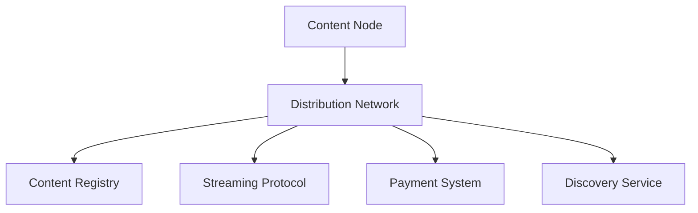

# RFC 0007: Decentralized Audio Content Distribution Network for Solana Earphone

## Abstract

This RFC proposes a decentralized audio content distribution network for Solana Earphone, enabling peer-to-peer audio content sharing, streaming, and monetization. The network leverages blockchain technology and distributed storage to create a censorship-resistant, efficient, and fair ecosystem for audio content creators and consumers.

## Motivation

Current audio content distribution systems face several challenges:
- Centralized control and censorship
- High distribution costs
- Limited creator monetization
- Poor content discovery
- Restricted user privacy

By implementing a decentralized audio content distribution network, we can:
- Enable direct creator-to-listener connections
- Reduce distribution costs
- Enhance content monetization
- Improve content discovery
- Protect user privacy
- Ensure content availability

## Technical Design

### 1. Network Architecture

#### 1.1 System Components



#### 1.2 Core Components

1. **Content Node**
   - Content storage
   - Streaming service
   - Cache management
   - Bandwidth contribution

2. **Distribution Network**
   - P2P routing
   - Content delivery
   - Load balancing
   - Network optimization

3. **Content Registry**
   - Content metadata
   - Rights management
   - Version control
   - Access control

4. **Streaming Protocol**
   - Adaptive bitrate
   - Low-latency delivery
   - Quality of service
   - Bandwidth optimization

5. **Payment System**
   - Micropayments
   - Revenue sharing
   - Subscription management
   - Token economics

6. **Discovery Service**
   - Content indexing
   - Search optimization
   - Recommendation engine
   - Social features

### 2. Protocol Design

#### 2.1 Content Protocol

```typescript
interface ContentNode {
  // Node identity
  nodeId: string;
  publicKey: string;
  capabilities: NodeCapability[];
  
  // Content management
  storage: ContentStorage;
  cache: ContentCache;
  
  // Network state
  peers: PeerConnection[];
  contentRegistry: ContentRegistry;
  bandwidth: BandwidthAllocation;
}

interface ContentRegistry {
  contents: Map<string, ContentMetadata>;
  rights: Map<string, RightsInfo>;
  versions: Map<string, VersionInfo>;
  access: Map<string, AccessControl>;
}

interface StreamingProtocol {
  // Streaming management
  sessions: StreamSession[];
  quality: QualityLevel;
  bandwidth: BandwidthControl;
  
  // Delivery optimization
  routing: StreamRouting;
  caching: StreamCache;
  recovery: StreamRecovery;
}
```

#### 2.2 Content Delivery

```typescript
interface ContentDelivery {
  // Content streaming
  stream: AudioStream;
  quality: StreamQuality;
  buffer: StreamBuffer;
  
  // Delivery management
  routing: DeliveryRoute;
  recovery: ErrorRecovery;
  monitoring: StreamMetrics;
}

interface ContentMetadata {
  // Content information
  id: string;
  title: string;
  creator: string;
  type: ContentType;
  
  // Technical details
  format: AudioFormat;
  duration: number;
  size: number;
  quality: AudioQuality;
  
  // Rights and access
  rights: RightsInfo;
  access: AccessControl;
  pricing: PricingModel;
}
```

### 3. Content Management

#### 3.1 Content Types

1. **Audio Content**
   - Music
   - Podcasts
   - Audiobooks
   - Voice messages
   - Sound effects

2. **Metadata**
   - Content information
   - Creator details
   - Rights management
   - Usage statistics

3. **User Data**
   - Preferences
   - History
   - Playlists
   - Social connections

#### 3.2 Storage Management

```typescript
interface StorageSystem {
  // Storage management
  capacity: StorageCapacity;
  allocation: StorageAllocation;
  replication: ReplicationFactor;
  
  // Content organization
  indexing: ContentIndex;
  caching: CacheStrategy;
  cleanup: CleanupPolicy;
}
```

### 4. Security and Privacy

#### 4.1 Security Measures

1. **Content Protection**
   - Digital rights management
   - Content encryption
   - Access control
   - Anti-piracy measures

2. **Network Security**
   - Node authentication
   - Traffic encryption
   - DDoS protection
   - Sybil resistance

3. **Privacy Protection**
   - Anonymous streaming
   - Private content
   - Data minimization
   - User consent

#### 4.2 Rights Management

```typescript
interface RightsManagement {
  // Rights tracking
  rights: RightsInfo;
  licenses: LicenseInfo[];
  usage: UsageTracking;
  
  // Enforcement
  verification: RightsVerification;
  compliance: ComplianceCheck;
  reporting: ViolationReport;
}
```

### 5. Economic Model

#### 5.1 Content Economics

1. **Revenue Streams**
   - Content sales
   - Streaming revenue
   - Subscription fees
   - Premium features

2. **Incentive Mechanisms**
   - Content hosting
   - Bandwidth contribution
   - Quality assurance
   - Community participation

#### 5.2 Payment System

```typescript
interface PaymentSystem {
  // Payment processing
  transactions: Transaction[];
  settlements: Settlement[];
  subscriptions: Subscription[];
  
  // Revenue distribution
  distribution: RevenueDistribution;
  sharing: RevenueSharing;
  reporting: RevenueReport;
}
```

## Implementation Guidelines

### 1. Development Stack

1. **Core Components**
   - Rust for node implementation
   - Solana for blockchain integration
   - IPFS for content storage
   - libp2p for P2P networking

2. **Content Framework**
   - WebRTC for streaming
   - FFmpeg for audio processing
   - TensorFlow for recommendations
   - WebAssembly for execution

### 2. Deployment Strategy

1. **Phase 1: Foundation**
   - Basic P2P network
   - Content registry
   - Streaming protocol
   - Payment system

2. **Phase 2: Growth**
   - Advanced features
   - Creator tools
   - Listener experience
   - Integration APIs

3. **Phase 3: Ecosystem**
   - Marketplace
   - Social features
   - Advanced analytics
   - Cross-platform support

## Performance Requirements

1. **Streaming Performance**
   - Initial latency: < 1s
   - Adaptive bitrate: 64kbps - 320kbps
   - Buffer size: < 5s
   - Recovery time: < 2s

2. **Network Performance**
   - Node sync: < 5s
   - Content discovery: < 200ms
   - Payment processing: < 3s
   - Bandwidth efficiency: > 90%

## Future Work

1. **Short Term**
   - Implement basic P2P network
   - Develop streaming protocol
   - Create content registry
   - Establish payment system

2. **Long Term**
   - Advanced content discovery
   - AI-powered recommendations
   - Cross-platform integration
   - Community governance

## References

1. Solana Documentation
2. IPFS Protocol Specification
3. WebRTC Standards
4. Audio Streaming Best Practices 